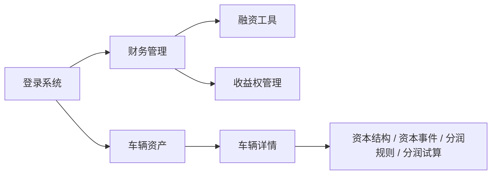
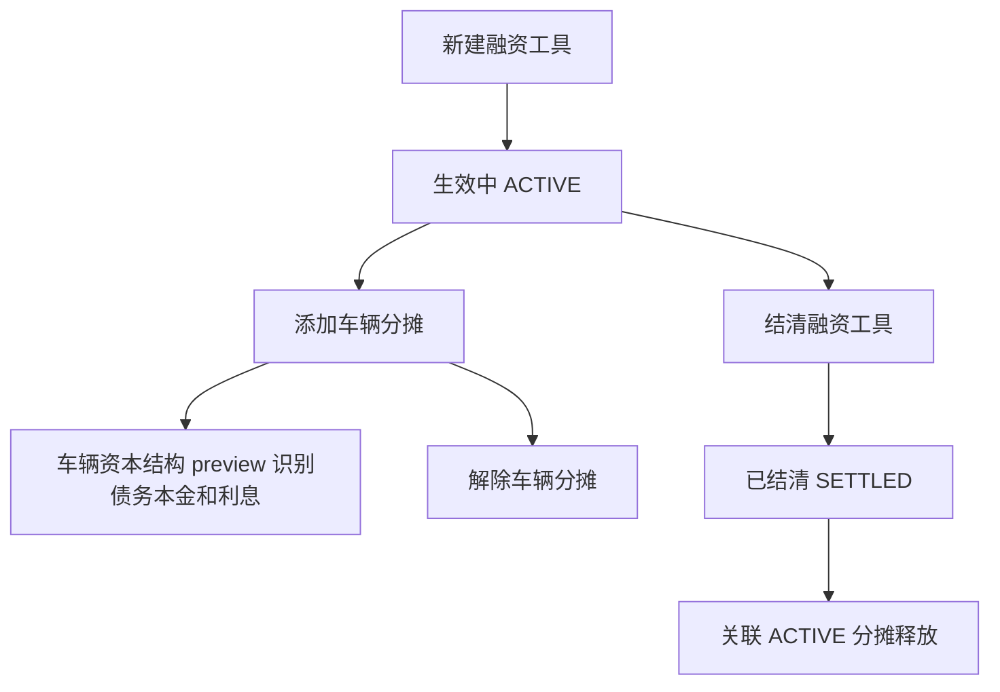
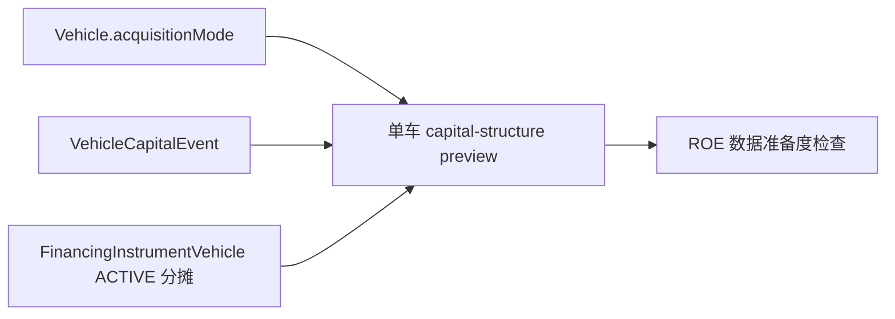
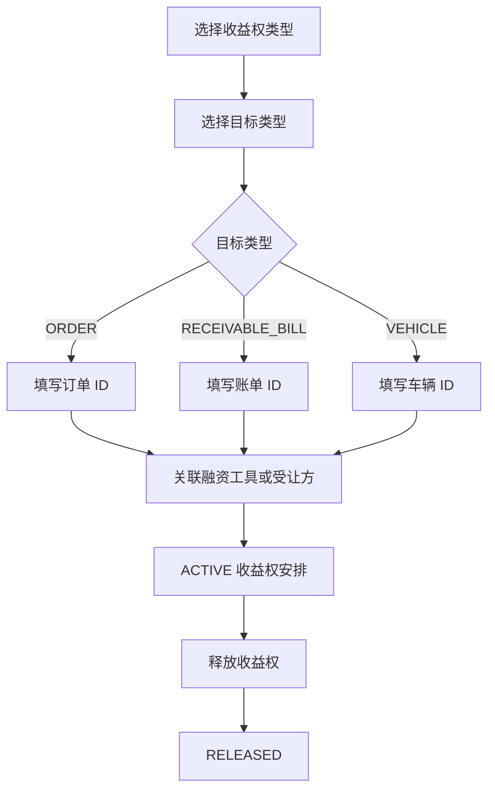
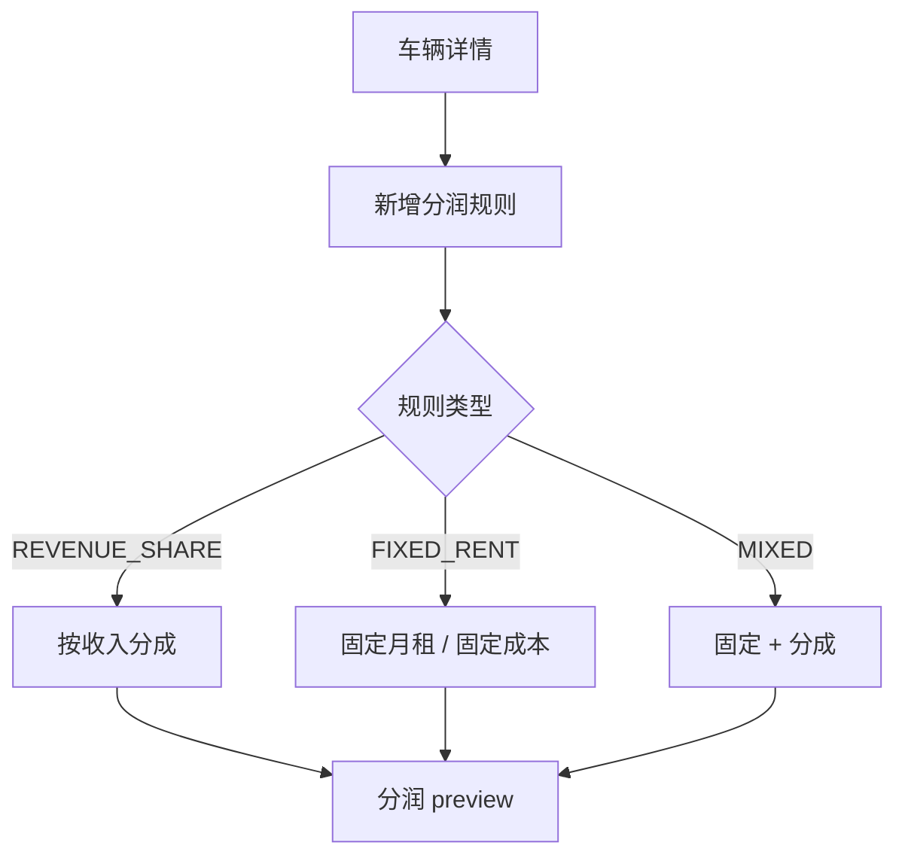

# 融资工具管理与收益权管理使用手册

本文用于 Stage 8.3C 人工验收，覆盖前端菜单、融资工具、车辆分摊、收益权安排、车辆资本结构、分润规则和分润试算。

## 一、进入前准备

1. 退出登录并重新登录，刷新 access_token。
2. 推荐使用 ADMIN 或 FI 账号验收完整管理功能。
3. GM、OP、AS 侧重查看权限验收，管理按钮应隐藏或不可操作。

## 二、菜单入口



| 功能 | 菜单 | 主要权限 |
| --- | --- | --- |
| 融资工具管理 | 财务管理 -> 融资工具 | financing:view / financing:manage |
| 收益权管理 | 财务管理 -> 收益权管理 | revenue_right:view / revenue_right:manage |
| 单车资本结构 | 车辆资产 -> 车辆详情 | capital_structure:view / capital_structure:manage |
| 单车分润规则 | 车辆资产 -> 车辆详情 | revenue_share:view / revenue_share:manage |

## 三、融资工具管理

融资工具表示一份外部融资合同或资金工具，例如融资租赁、银行车贷、项目贷款、个人借款、应收账款质押融资。



### 1. 新建融资工具

路径：财务管理 -> 融资工具 -> 新增融资工具。

| 字段 | 含义 | 验收建议 |
| --- | --- | --- |
| 融资工具类型 | 融资合同类型 | 融资租赁选 FINANCE_LEASE |
| 资金方名称 | 银行、租赁公司、个人或 SPV 名称 | 填真实或测试资金方 |
| 合同编号 | 外部合同编号 | 可填 FL-2026-001 |
| 本金金额（元） | 融资工具总本金 | 页面填元，后端存分 |
| 年化利率（%） | 年利率百分比 | 6.5 会提交为 650 bps |
| 开始日期 / 到期日期 | 合同起止日期 | 到期日期不能早于开始日期 |
| 期限（月） | 合同期限 | 36 表示 36 个月 |
| 还款方式 | 还款口径 | 当前只用于展示和 preview 基础 |
| 担保类型 | 抵押或质押标的 | 单车融资选 VEHICLE |

### 2. 融资工具类型释义

| 类型 | 页面显示 | 业务含义 |
| --- | --- | --- |
| FINANCE_LEASE | 融资租赁 | 融资租赁公司提供车辆融资 |
| BANK_AUTO_LOAN | 银行车贷分期 | 单车或批量车贷 |
| BANK_PROJECT_LOAN | 银行项目贷款 | 项目级授信或车队资金 |
| PERSONAL_LOAN | 个人借款 | 个人出借资金 |
| RECEIVABLE_PLEDGE | 应收账款权益质押融资 | 用订单或账单现金流质押 |
| ABS_OR_SPV | ABS / SPV 资产池融资 | 资产池或专项计划融资 |
| OTHER | 其他 | 暂不归类的融资工具 |

### 3. 添加车辆分摊

路径：融资工具列表 -> 查看详情 -> 添加车辆分摊。

页面会提供车辆下拉搜索，可按车辆编号、车牌、VIN 或车型搜索。选择后，前端会提交系统车辆 ID。

```text
正确：在下拉中选择 “VEH202606... / 车牌 / VIN / 车型”
避免：手工把 VEH202606... 填成 vehicleId
```

| 字段 | 含义 | 验收建议 |
| --- | --- | --- |
| 车辆 | 被融资工具覆盖的车辆 | 从下拉选择 |
| 分摊本金（元） | 该车对应的融资本金 | 不得超过融资工具剩余额度 |
| 分摊比例（%） | 该车分摊比例 | 单车全额分摊可填 100 |
| 生效日期 | 该车开始被该融资工具覆盖的日期 | 通常等于融资开始日 |
| 备注 | 操作说明 | 例如“该车对应融资本金” |

常见失败原因：

| 错误 | 原因 | 处理 |
| --- | --- | --- |
| 融资工具不是生效中状态 | 工具已结清或取消 | 换 ACTIVE 工具 |
| 分摊金额不能超过融资本金 | ACTIVE 分摊合计超过 principalAmount | 降低分摊金额或先解除其他分摊 |
| 同一融资工具与车辆已存在生效分摊 | 重复添加同一车 | 先解除原分摊或改用其他车 |
| vehicleId 必须是系统车辆 ID | 手工填写了 VEH 业务编号 | 使用车辆下拉选择 |

### 4. 解除分摊与结清

解除车辆分摊：融资工具详情 -> 分摊列表 -> 解除分摊。解除后该 allocation 状态变为 RELEASED。

结清融资工具：融资工具列表或详情 -> 结清。结清后工具状态变为 SETTLED，后端会释放关联 ACTIVE 分摊。

## 四、车辆资本结构区块

路径：车辆资产 -> 车辆详情 -> 资本结构。



| 展示项 | 含义 |
| --- | --- |
| 取得方式 | 自有资金购入、融资购入、外部长租、托管收益分成 |
| 自有资金金额 | 当前可识别的权益资金 |
| 债务本金金额 | ACTIVE 融资分摊本金合计 |
| 资本覆盖金额 | 自有资金 + 债务本金 |
| 资本覆盖率 | 资本覆盖金额 / 采购价 |
| 年化债务利息试算 | 分摊本金 * 年化利率 |
| ROE 数据是否完整 | 本阶段只检查数据准备度，不计算 ROE |

资本事件用于记录生命周期变化，例如初始自有资金购入、新增债务融资、提前结清、外部长租接入、托管车辆接入。

## 五、收益权管理

收益权安排用于记录订单、账单或车辆收益权是否质押、转让、进入 SPV 资产池，或归属于托管车主。



### 1. 收益权类型释义

| 类型 | 页面显示 | 业务含义 |
| --- | --- | --- |
| PLEDGE | 收益权质押 | 收益权作为融资担保 |
| TRANSFER | 收益权转让 | 收益权转给资方或 SPV |
| SPV_POOL | SPV / 资产池归集 | 现金流进入资产池 |
| REVENUE_SHARE | 收益分成 | 托管或合作车辆收益归属 |
| OTHER | 其他 | 暂不归类 |

### 2. 目标类型释义

| 目标类型 | 必填字段 | 适用场景 |
| --- | --- | --- |
| ORDER | orderId | 某订单收入收益权 |
| RECEIVABLE_BILL | billId | 某账单应收收益权 |
| VEHICLE | vehicleId | 某车整体收益权或托管收益归属 |
| VEHICLE_POOL | snapshot | 后续车辆池场景，当前不做复杂池模型 |

PLEDGE、TRANSFER、SPV_POOL 建议必须关联融资工具。shareRatio 表示收益权比例，页面填百分比，后端存 bps。

### 3. 释放收益权

路径：收益权管理 -> 释放。

释放后：

1. assignmentStatus 变为 RELEASED；
2. releasedAt 和 effectiveTo 写入释放日期；
3. releaseReason 记录释放原因；
4. 本阶段不做现金流回拨、自动结算或会计入账。

## 六、车辆分润规则与分润试算

分润规则用于托管车辆或外部长租车辆的收益分成、固定租金或混合成本规则。



| 规则类型 | 必填重点 | 适用场景 |
| --- | --- | --- |
| REVENUE_SHARE | 车主分成比例 > 0 | 托管车辆按收入分成 |
| FIXED_RENT | 固定月金额 > 0 | 外部长租固定租金 |
| MIXED | 分成比例或固定月金额至少一项 | 固定保底 + 分成 |

| 分润基础 | 当前 preview 支持 | 说明 |
| --- | --- | --- |
| RENTAL_PAID | 支持 | FIRST_MONTHLY_FEE + MONTHLY_RENT 实收 |
| OPERATING_REVENUE | 支持 | 租金实收 + DAMAGE_FEE + OTHER |
| GROSS_RECEIVABLE | 暂不支持 | 后续按应收口径实现 |
| MANUAL | 暂不支持 | 手工结算，不自动试算 |

押金 DEPOSIT 不参与分润 preview。

固定月金额折算：

```text
fixedCostAmount = fixedMonthlyAmount * 12 / 365 * 查询天数
```

车主分润：

```text
ownerShareAmount = shareBaseAmount * ownerShareBps / 10000 + fixedCostAmount
```

平台留存：

```text
platformShareAmount = shareBaseAmount - shareBaseAmount * ownerShareBps / 10000 - fixedCostAmount
```

如果平台留存为负，表示固定成本或分成比例可能过高，需要业务复核。

## 七、人工验收建议路径

1. ADMIN 登录。
2. 打开财务管理 -> 融资工具。
3. 新增融资租赁工具。
4. 查看详情，确认状态为生效中。
5. 添加车辆分摊，用下拉选择车辆。
6. 到车辆详情查看资本结构 preview。
7. 新增资本事件，关联该融资工具。
8. 回融资工具详情解除分摊。
9. 结清融资工具。
10. 打开收益权管理。
11. 新增订单或账单收益权质押。
12. 释放收益权安排。
13. 到车辆详情新增分润规则。
14. 设置日期范围，查看分润 preview。
15. 停用分润规则。
16. 使用 GM、OP、AS 或低权限账号检查菜单和按钮权限。

## 八、本阶段边界

本阶段只做事实数据管理和 preview，不做以下事项：

1. 不计算正式 ROE；
2. 不接入收益试算 API；
3. 不做真实融资还款计划；
4. 不做收益权现金流归集；
5. 不做真实分润结算或付款；
6. 不做财务入账或会计凭证；
7. 不做残值预测。
