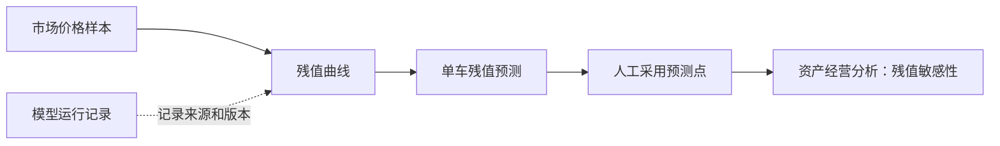
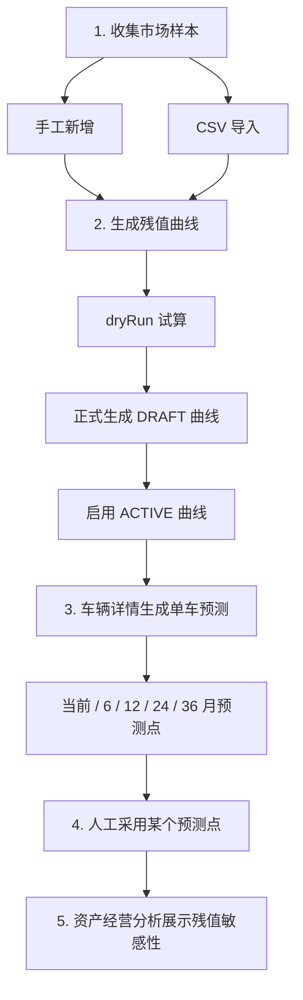
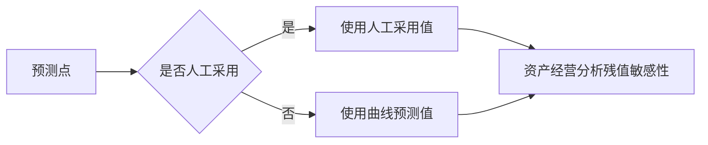
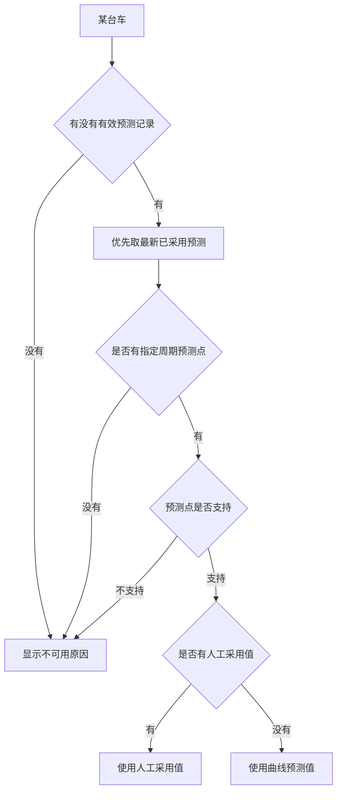

# 市场残值样本库使用说明书

本文面向运营、资产、财务和管理层用户，说明“市场残值样本库”怎么用，以及它如何进入“资产经营分析”的收益试算。本文尽量使用业务语言，不展开底层技术实现。

## 一句话说明

市场残值样本库用于收集外部市场价格，形成残值曲线，再给单台车生成残值预测；资产经营分析只把这些预测作为“敏感性参考”，不会自动改车辆当前销售价，也不会改变主 ROE。



## 入口和权限

入口：

```text
车辆资产 -> 市场残值样本
```

页面包含四个页签：

| 页签 | 主要用途 | 常用操作 |
| --- | --- | --- |
| 市场价格样本 | 维护外部市场价格事实 | 查询、手工新增、CSV 导入、查看详情、作废 |
| 导入批次 | 查看 CSV 导入结果 | 查看总行数、导入行数、跳过行数、失败行数 |
| 残值曲线 | 从样本生成统计曲线 | 试算、正式生成、启用、归档 |
| 模型运行记录 | 记录曲线或模型来源 | 新增运行记录、标记完成、失败、取消、查看输出 |

常见权限：

| 权限 | 能做什么 |
| --- | --- |
| `residual_market:view` | 查看市场样本和导入批次 |
| `residual_market:manage` | 新增、作废市场样本 |
| `residual_market:import` | 导入 CSV |
| `residual_curve:view` | 查看残值曲线 |
| `residual_curve:generate` | 生成残值曲线 |
| `residual_curve:manage` | 启用、归档残值曲线 |
| `residual_model_run:view` | 查看模型运行记录 |
| `residual_model_run:manage` | 创建、完成、失败、取消模型运行记录 |

如果刚调整过权限，请退出登录并重新登录，以刷新权限。

## 核心概念

| 名称 | 含义 | 是否会自动改车辆价格 |
| --- | --- | --- |
| 车辆当前销售价 | 内部运营当前估值或销售价 | 人工维护，不会被样本覆盖 |
| 市场价格样本 | 外部挂牌价、成交价、拍卖价、经销商报价等 | 不会 |
| 残值曲线 | 按品牌、车系、车型、年款、电池规格生成的统计结果 | 不会 |
| 单车残值预测 | 把已启用曲线应用到具体车辆得到的预测值 | 不会 |
| 人工采用值 | 人工选择某个预测点并确认金额 | 只记录在预测点，不会写销售价历史 |
| 残值敏感性 ROE | 用预测残值观察收益试算变化 | 不改变主 ROE |

## 功能链路总览



## 一、市场价格样本

### 1. 样本是什么

一条样本代表某个日期、某个来源看到的一条市场价格事实。

例子：

| 日期 | 来源 | 品牌 | 车型 | 价格类型 | 金额 |
| --- | --- | --- | --- | --- | --- |
| 2026-06-01 | 二手车平台 | NIO | ET5 | 挂牌价 | 168,000 元 |
| 2026-06-03 | 拍卖 | NIO | ES6 | 拍卖价 | 185,000 元 |

### 2. 手工新增

路径：

```text
市场残值样本库 -> 市场价格样本 -> 新增市场样本
```

必填字段：

| 字段 | 说明 |
| --- | --- |
| 来源 | 手工录入、CSV 导入、拍卖、经销商报价等 |
| 观测日期 | 看到这条市场价格的日期 |
| 品牌 | 例如 NIO |
| 车型 | 例如 ET5 |
| 价格类型 | 挂牌价、成交价、拍卖价等 |
| 价格 | 页面按元输入 |

保存后，样本状态默认为“有效”。有效样本才会参与残值曲线统计。

### 3. CSV 导入

路径：

```text
市场残值样本库 -> 市场价格样本 -> 导入 CSV
```

导入规则：

| 项目 | 说明 |
| --- | --- |
| 文件格式 | CSV 文本 |
| 金额填写 | 按元填写 |
| 后端保存 | 按分保存 |
| 必填字段 | `observedAt`、`brand`、`model`、`priceType`、`priceAmount` |
| 重复样本 | 自动跳过 |
| 失败行 | 不阻断整批导入 |

常用枚举值：

| 字段 | 可选值 |
| --- | --- |
| `batteryUsageType` | `BUYOUT` 买断；`BAAS` BaaS |
| `priceType` | `LISTING` 挂牌价；`TRANSACTION` 成交价；`AUCTION` 拍卖价；`DEALER_QUOTE` 经销商报价；`INTERNAL_SALE` 内部成交价；`ESTIMATE` 估算价 |
| `sellerType` | `INDIVIDUAL` 个人；`DEALER` 经销商；`PLATFORM` 平台；`AUCTION_HOUSE` 拍卖机构；`INTERNAL` 内部；`UNKNOWN` 未知 |

### 4. 作废样本

如果发现样本明显错误，可以作废。

```text
作废后：
1. 样本不会被删除；
2. 状态变为“已作废”；
3. 后续不参与残值曲线统计；
4. 仍保留审计记录。
```

## 二、导入批次

导入批次用于检查 CSV 导入是否成功。

| 指标 | 含义 |
| --- | --- |
| 总行数 | CSV 中参与处理的行数 |
| 导入行数 | 成功入库的样本数 |
| 跳过行数 | 重复样本或被跳过的行数 |
| 失败行数 | 字段错误、金额错误等失败行 |
| 导入状态 | 已完成、部分失败、失败 |

建议导入后先看批次详情，确认失败原因，再决定是否修正 CSV 后重新导入。

## 三、残值曲线

### 1. 曲线用来做什么

残值曲线用于回答：

```text
某品牌 / 车系 / 车型 / 年款 / 电池规格的车，
在不同车龄月份下，市场上大概值多少钱？
```

曲线第一版按车龄月份统计，不按里程分桶。


### 2. 生成曲线

路径：

```text
市场残值样本库 -> 残值曲线 -> 生成残值曲线
```

建议步骤：

1. 填写品牌和车型。
2. 可选填写车系、年款、电池容量、电池使用方式。
3. 选择价格类型和样本日期范围。
4. 点击“试算”，先看匹配样本数和曲线点。
5. 样本足够时再“正式生成”。
6. 正式生成后得到草稿曲线。
7. 复核后点击“启用”。

### 3. 曲线状态

| 状态 | 含义 | 是否可用于单车预测 |
| --- | --- | --- |
| 草稿 | 已生成但未启用 | 否 |
| 生效中 | 当前可用曲线 | 是 |
| 已被替代 | 被同维度新曲线替代 | 一般不用 |
| 已归档 | 已停用保留记录 | 否 |

启用新曲线时，同一维度旧的生效曲线会变为“已被替代”。

### 4. 模型运行记录关联

生成曲线时有三种选择：

| 方式 | 适合场景 |
| --- | --- |
| 不关联模型运行记录 | 临时生成、测试或不需要治理追溯 |
| 关联已有模型运行记录 | 已经提前登记了某次统计基线或模型运行 |
| 自动创建模型运行记录 | 希望系统自动登记这次统计曲线来源 |

说明：

```text
模型运行记录只是追踪“这条曲线怎么来的”。
当前阶段不会执行真实 AI 训练，也不会调用第三方模型。
```

## 四、单车残值预测

单车预测在车辆详情页使用。

路径：

```text
车辆资产 -> 打开车辆详情 -> 残值预测
```

生成预测前请确认：

| 条件 | 说明 |
| --- | --- |
| 初次上牌日期 | 用来计算车龄，缺失则不能预测 |
| 品牌和车型 | 用来匹配生效残值曲线 |
| 生效残值曲线 | 至少要有一条匹配的 ACTIVE 曲线 |

默认预测周期：

```text
当前、未来 6 个月、未来 12 个月、未来 24 个月、未来 36 个月
```

预测点可能出现三种匹配方式：

| 匹配方式 | 含义 |
| --- | --- |
| 精确匹配 | 曲线刚好有目标车龄点 |
| 线性插值 | 目标车龄在两个曲线点之间，系统按两侧价格估算 |
| 超出范围 | 目标车龄不在曲线范围内，第一版不做外推 |

## 五、人工采用预测点

预测值只是系统参考。真正进入资产经营分析时，系统优先使用“人工采用值”。



采用规则：

| 项目 | 说明 |
| --- | --- |
| 可采用点 | 预测点状态不是“暂不支持” |
| 采用金额 | 页面按元输入 |
| 保存位置 | 只保存在预测点上 |
| 不会做的事 | 不覆盖车辆当前销售价，不写销售价历史 |

## 六、资产经营分析如何使用残值

入口：

```text
经营看板 -> 资产经营分析 -> 收益试算
```

收益试算页面会展示两类结果：

| 类型 | 用途 |
| --- | --- |
| 主试算 ROE | 当前主口径，仍按原收益、成本、资本结构计算 |
| 残值敏感性 ROE | 在主口径基础上，观察预测残值变化后的影响 |

重要结论：

```text
残值预测不会改变主 ROE。
残值预测只增加一组“如果按这个残值看，会怎样”的参考结果。
```

### 1. 残值预测周期

收益试算 Tab 顶部有：

```text
残值预测周期
```

常用选项：

| 选项 | 含义 |
| --- | --- |
| 当前 | 使用 horizon = 0 的预测点 |
| 未来 6 个月 | 使用 horizon = 6 的预测点 |
| 未来 12 个月 | 使用 horizon = 12 的预测点 |
| 未来 24 个月 | 使用 horizon = 24 的预测点 |
| 未来 36 个月 | 使用 horizon = 36 的预测点 |

如果某台车没有对应周期的预测点，页面会显示不可用原因。

### 2. 系统如何选择预测值



优先级：

1. 优先取状态为“已采用”的最新预测记录。
2. 如果没有已采用预测，再取“已生成”的最新预测记录。
3. 在该预测记录中，只取页面选择的预测周期。
4. 如果预测点有人工采用值，优先用人工采用值。
5. 否则用曲线预测值。

### 3. 页面重点指标

| 指标 | 怎么看 |
| --- | --- |
| 可用残值预测车辆数 | 有可用预测值的车辆数 |
| 缺少残值预测车辆数 | 没有有效预测记录或没有指定周期预测点 |
| 不支持残值预测车辆数 | 预测点超出曲线范围等原因导致不可用 |
| 已采用残值预测车辆数 | 预测点有人工采用值的车辆数 |
| 预测残值合计 | 当前筛选车辆可用预测残值之和 |
| 预测下界 / 上界 | 预测残值的参考区间 |
| 相对当前销售价差异 | 预测残值 - 车辆当前销售价 |
| 相对成本参数残值差异 | 预测残值 - 成本参数预计残值 |
| 残值敏感性 ROE | 把残值差异放入试算后的参考 ROE |

### 4. 简单公式

```text
相对当前销售价差异 = 预测残值 - 车辆当前销售价

相对成本参数残值差异 = 预测残值 - 成本参数预计残值

残值敏感性净收益 = 平台权益净收益 + 相对成本参数残值差异

残值敏感性 ROE = 残值敏感性净收益 / 权益资本基数
```

主 ROE 不变：

```text
主 ROE = 平台权益净收益 / 权益资本基数
```

### 5. 举例

假设某台车：

| 项目 | 金额 |
| --- | ---: |
| 平台权益净收益 | 20,000 元 |
| 成本参数预计残值 | 120,000 元 |
| 12 个月预测残值 | 130,000 元 |
| 权益资本基数 | 100,000 元 |

计算：

```text
相对成本参数残值差异 = 130,000 - 120,000 = 10,000 元
残值敏感性净收益 = 20,000 + 10,000 = 30,000 元
主 ROE = 20,000 / 100,000 = 20.00%
残值敏感性 ROE = 30,000 / 100,000 = 30.00%
```

解释：

```text
这不代表主 ROE 从 20% 自动变成 30%。
它只说明：如果未来残值按 130,000 元看，收益试算会更好。
```

## 七、日常使用建议

### 建议操作顺序

| 顺序 | 操作 | 目的 |
| --- | --- | --- |
| 1 | 导入或新增市场样本 | 积累外部价格事实 |
| 2 | 作废明显错误样本 | 保持样本质量 |
| 3 | dryRun 生成残值曲线 | 先看样本是否足够 |
| 4 | 正式生成并启用曲线 | 形成可用参考曲线 |
| 5 | 在车辆详情生成单车预测 | 得到单车当前和未来残值 |
| 6 | 人工采用可信预测点 | 形成经营分析参考值 |
| 7 | 在资产经营分析查看敏感性 | 看残值变化对收益试算的影响 |

### 看结果时先看三件事

1. 样本是否足够：曲线点太少时，不要轻易启用。
2. 预测是否可用：车辆是否有初次上牌日期，是否匹配到生效曲线。
3. 来源是否清楚：预测值是人工采用，还是曲线预测。

## 八、常见问题

### 1. 为什么导入 CSV 后有些行被跳过？

通常是重复样本。系统会根据来源、车型、日期、里程、城市、价格类型、价格等信息识别重复，避免同一条市场信息重复影响曲线。

### 2. 为什么生成单车预测时提示缺少上牌日期？

单车预测用“初次上牌日期”计算车龄。如果车辆没有维护初次上牌日期，系统无法判断当前车龄。

### 3. 为什么某些预测点显示暂不支持？

目标车龄超出了当前残值曲线的范围。第一版不做外推，避免给出不可靠的远期价格。

### 4. 人工采用值会修正残值曲线吗？

不会。人工采用值只影响该车辆的预测点和资产经营分析中的残值敏感性，不会反向修改残值曲线。

### 5. 残值敏感性 ROE 是正式 ROE 吗？

不是。它是参考分析，用于观察残值变化带来的影响。主 ROE 仍按原主口径展示。

### 6. 模型运行记录是不是 AI 训练？

不是。当前只是记录“曲线或预测从哪里来、用什么版本、输出了什么”。后续如果接入真实 AI / ML，才会在这个基础上继续扩展。

## 九、验收清单

| 检查项 | 预期结果 |
| --- | --- |
| 市场样本可新增、可导入、可作废 | 样本列表状态正确 |
| 导入批次可查看 | 成功、跳过、失败行统计清楚 |
| 曲线可 dryRun | 展示样本数和曲线点 |
| 曲线可正式生成 | 生成草稿曲线 |
| 曲线可启用 | 状态变为生效中 |
| 车辆可生成预测 | 展示当前和未来预测点 |
| 预测点可人工采用 | 采用值展示在预测点上 |
| 收益试算可选残值周期 | 汇总、列表、详情跟随周期变化 |
| 主 ROE 与残值敏感性 ROE 并列展示 | 两者不混淆 |
| 模型运行记录可追踪输出 | 可看到关联曲线或预测 |

