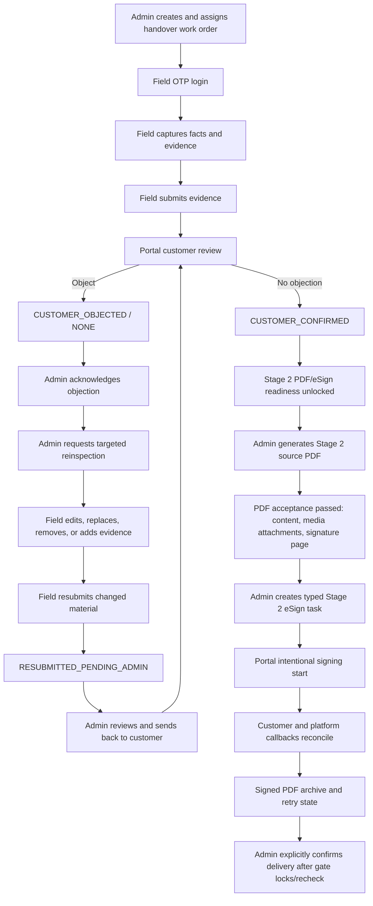

# Stage 2 Local Handover E2E Runbook

## Scope

This runbook validates the local Stage 2 handover path from field evidence through Portal review, accepted PDF rendering, typed provider mapping, lifecycle/callback reconciliation, archive retry, and the final delivery gate. It is an offline harness only.

All provider/storage/database collaborators used by the focused tests are mocked or local. This run does not connect to an environment database, call Fadada or another provider, send notifications, confirm a live delivery, start a lease, or start billing. Controlled sandbox validation is a separate required step.

## Closed-loop workflow



The Admin entry points are the order detail Stage 2 module and
`/handover-review-queue`. Field uses `/field/handover`,
`/field/handover/tasks`, and `/field/handover/tasks/:id`. The customer uses
`/portal/handover-reviews/:id`.

Every workflow mutation appends a typed handover event. Evidence replacement
and removal retain the original database row as `SUPERSEDED` or `REMOVED`;
only `ACTIVE` files appear in the current checklist. Normal evidence items
have one active file and support replace/remove. Damage close-ups support up
to 20 active files so multiple damage locations can be documented.

## Local Harness

API test:

- `apps/api/test/stage2-handover-e2e.spec.ts`

The focused API harnesses use synthetic in-memory data and mocked Prisma/storage/evidence collaborators. Together they cover:

- external field operator starts the handover work order;
- field facts are captured;
- required evidence files are attached with safe synthetic `fileId` records;
- no-visible-damage declaration is recorded;
- field evidence is submitted to customer review;
- Portal customer lists and opens the submitted review;
- Portal customer sees safe evidence preview/download links;
- Portal customer confirms no objection;
- Portal customer submits an objection on a fresh fixture;
- Admin acknowledges the objection, requests field resubmission, and sends the resubmitted evidence back to Portal review;
- Admin generates the Stage 2 source PDF after customer confirmation;
- the generated PDF uses the separate `DELIVERY_HANDOVER` contract path and safe `FileObject` download route;
- unauthorized customer and field-session boundary checks;
- terminal and already-confirmed/objected state checks;
- no eSign/provider/delivery/lease/billing side effects.
- typed Stage 2 provider mapping rejects wrong stage/document/slot/action/coordinate tuples;
- readiness exposes stable blockers and performs local reads only;
- Admin/Portal lifecycle status is safe and only Portal signing start can return a short-lived URL;
- callbacks correlate by typed transaction, deduplicate canonical sanitized payloads, and reconcile either signer order;
- archive validates PDF MIME/magic/size/hash and exercises five-minute claim lease/reclaim;
- delivery remains an explicit Admin action behind current manifest and signed-artifact checks.

Web test:

- `apps/web/test/stage2-handover-ui-flow.spec.ts`

The Web harness uses mocked `fetch` calls only. It covers:

- field submit API boundary and submitted/locked capture view;
- Portal list/detail/confirm API boundary;
- Portal evidence file viewing boundary;
- Portal objection API boundary;
- Admin Stage 2 handover review entry and objection action boundary;
- Admin Stage 2 source PDF generate/download entry;
- acknowledgement/object reason view-model behavior;
- source-level absence of eSign, delivery confirmation, payment, or billing controls before later phases;
- view-model serialization that excludes object storage, signing URL, token/cookie, identity, provider, and finance internals.

## Readiness Expectations

Before a new order can enter the local or staging handover work-order path:

- Stage 1 signing must be complete.
- Delivery readiness must pass the base order/vehicle checks.
- Insurance readiness requires both a non-deleted active compulsory traffic policy and a non-deleted active commercial policy from `VehicleInsurancePolicy` to cover the planned delivery date. `VehicleInsurancePolicy` is the sole source of truth; vehicle master policy dates are not used as fallback.
- A zero required deposit must be treated as satisfied automatically. Non-zero deposits still require confirmation.
- First monthly fee readiness depends on receivable bill write-off. A confirmed payment record without write-off should be shown as registered but pending write-off, not as settled.
- Admin order detail must expose the Stage 2 create-work-order action once delivery preparation is ready and no active work order exists.

Before field submit:

- field readiness is blocked by incomplete field facts/evidence;
- Stage 2 PDF/eSign readiness is false.

After field submit:

- the work order is customer-reviewable;
- Portal review is visible only to the owning customer;
- Stage 2 PDF/eSign readiness is still false because the customer has not confirmed no objection.

After customer confirmation:

- the work order moves to customer-confirmed;
- Stage 2 PDF/eSign readiness is true;
- no PDF is created automatically;
- no eSign task, provider call, delivery confirmation, lease, or billing side effect is created.

After Admin source PDF generation:

- a separate Stage 2 `Contract` is created with an `HDV...` document number and `status=GENERATED`;
- `VehicleDeliveryHandover` is linked to `handoverContractId`, `sourceDocumentFileId`, `sourceObjectKey`, and `status=SOURCE_GENERATED`;
- `SubscriptionOrder.contractId`, order status, Stage 1 contract rows, finance, lease, and billing state remain unchanged;
- no `ContractESignTask`, Fadada upload, signing URL, SMS, WeChat, delivery confirmation, lease, or billing side effect is created;
- the Admin UI exposes a protected download route for visual acceptance.

Current PDF visual acceptance has passed and covers:

- PDF content and metadata;
- vehicle/customer/field facts tables;
- fee/deposit and special-notice sections;
- customer signature and platform seal/signature areas;
- 14-row evidence summary with safe file metadata;
- all prepared photo derivatives at four photos per attachment page;
- video inventory, source SHA-256, duration, protected evidence-package reference, and four `WALKAROUND_VIDEO` keyframes;
- no embedded original video stream;
- full customer legal name, mobile, and identity number, full VIN, and the full lessor operator contact phone in the protected signing PDF;
- absence of raw object storage keys, buckets, private storage paths, signing URLs, and provider payloads from the signing PDF;
- masked/safe Portal, Field, and Admin status DTOs that do not expose the signing PDF's full identity or contact values.

After Admin Stage 2 eSign creation:

- the task uses `STAGE2_DELIVERY_HANDOVER` with document `DELIVERY_HANDOVER`;
- the runtime provider mapping uses document `DELIVERY_HANDOVER_CONFIRMATION`;
- exactly two required typed signer rows exist;
- `STAGE2_HANDOVER_CUSTOMER` maps to one `CUSTOMER_MANUAL_SIGN` / `extsign.api` transaction;
- `STAGE2_HANDOVER_PLATFORM` maps to one `PLATFORM_AUTO_SEAL` / `extsign_auto.api` transaction;
- persisted `FADADA_800_1131_TOP_LEFT` coordinates are zero-based, final-page, renderer-owned, and box-center based;
- the source PDF remains below the 18 MiB internal hard limit and the provider boundary enforces 20 MB.

After callback completion and archive:

- callbacks correlate through typed provider transaction IDs and do not use legacy fallback;
- canonical sanitized payload hash deduplication is provider-scoped;
- customer/platform completion can arrive in either order and completes only after both exact signer rows are signed;
- archive has a five-minute default stale claim lease/reclaim, PDF MIME/magic/size checks, signed SHA-256, and explicit retry;
- Task 6 orphan-object cleanup after storage succeeds but DB finalization fails remains deferred;
- eSign does not auto-confirm delivery, write `actualDeliveryAt`, activate a lease, start billing, or trigger Stage 1 `PENDING_PAYMENT`.

At final delivery:

- a complete signed artifact and current evidence-to-signed manifest bridge are mandatory;
- `archiveStatus=FAILED` is warning-only when the full signed artifact exists because `DELIVERY_HANDOVER_ARCHIVE_BLOCKS_DELIVERY_CONFIRMATION=false`;
- a missing signed artifact blocks;
- the explicit Admin transaction uses `READ COMMITTED` and fixed parent-to-child `FOR UPDATE` gate locks before re-reading and writing delivery state.

After customer objection:

- the work order moves to customer-objected;
- Stage 2 PDF/eSign readiness remains false;
- the blocker requires Admin follow-up;
- no PDF, eSign task, provider call, delivery confirmation, lease, or billing side effect is created.

After Admin-requested field resubmission:

- the field operator can edit the objected task again;
- resubmission keeps the work order customer-objected and marks admin review `RESUBMITTED_PENDING_ADMIN`;
- Portal confirmation remains blocked until Admin sends the resubmitted evidence back to customer review;
- sending back creates the next review attempt and returns the work order to customer-reviewing.

## Local Commands

Original focused API suite:

```bash
pnpm --filter @subscription-saas/api test -- test/stage2-esign-provider-mapping.spec.ts test/esign.spec.ts test/order-contract.spec.ts test/stage2-handover-e2e.spec.ts test/portal-handover-review.spec.ts test/handover-work-order.spec.ts test/delivery-evidence.spec.ts test/order-delivery.spec.ts test/field-operator-auth.spec.ts
```

Branch-focused Stage 2 specs:

```bash
pnpm --filter @subscription-saas/api test -- test/stage2-esign-schema.spec.ts test/stage2-handover-pdf.spec.ts test/stage2-handover-evidence-manifest.spec.ts test/stage2-handover-evidence-artifact.spec.ts test/stage2-handover-esign-readiness.spec.ts test/stage2-handover-esign-lifecycle.spec.ts test/stage2-handover-esign-archive.spec.ts test/delivery-handover.spec.ts test/fadada-archive.spec.ts
```

Quality gates for this documentation closure:

```bash
pnpm prisma:validate
pnpm --filter @subscription-saas/api typecheck
pnpm --filter @subscription-saas/api lint
pnpm --filter @subscription-saas/api build
```

Do not run Prisma migrate status/dev/deploy for this task, do not connect to a database, and do not call a provider or other network service. This is docs-only, so Web checks are not part of this closure.

## Controlled Sandbox Validation

A controlled sandbox is still required before provider rollout. Resolve and record:

1. Duplicate transaction idempotency: provider result and authoritative idempotency key.
2. Callback retry and out-of-order behavior for customer/platform completion.
3. Validity and scope of the configured platform auto-seal authorization/signature.
4. Observed sign-to-download availability delay.
5. Archive/filing idempotency after partial success.

Use synthetic controlled identities and documents only. Do not paste provider text, legal source documents, signing URLs, storage locators, credentials, OTPs, cookies, or JWTs into reports.

## Staging Smoke Boundary

Staging smoke should run only after a combined API/Web deployment. The deployed Web API base must point to the public H5/API domain used by that environment; staging validation must not rely on a local loopback API or port 3001.

The staging smoke should cover one controlled field evidence capture path, one Portal customer review path, and one Admin Stage 2 source PDF generation/download path. Fadada Stage 2 signing and archive must remain disabled until the separate controlled sandbox questions above are resolved; real notifications, delivery confirmation, lease, and billing remain outside that smoke.

Field evidence accepts photos up to 10MB and videos up to 300MB. The API Nginx virtual host must set `client_max_body_size 320m` or higher, `proxy_read_timeout`/`proxy_send_timeout` to `1200s`, and `proxy_request_buffering off`. Uploads are spooled to an OS temporary file before local/OSS persistence and the temporary file is cleaned up on success or failure. Validate proxy size, API multipart size, available temporary disk space, and storage connectivity when a large upload fails.

Browser smoke must cover:

- mobile WebKit as the local approximation for iPhone Safari;
- an iPhone WeChat user agent in Chromium/Edge;
- desktop Edge;
- Chrome in the normal Admin/Field manual pass;
- login inputs remaining editable while session detection is pending;
- a failed task-list request showing `重新加载` and recovering after retry.

Bodyless GET requests do not send a JSON `Content-Type`, which avoids an
unnecessary CORS preflight in stricter WebViews. API requests time out after
15 seconds and the Field task list/detail pages expose retry actions instead
of leaving the operator on an indefinite spinner.

## Open Items

- Controlled provider sandbox and real database concurrency validation have not run.
- Task 6 archive orphan-object cleanup remains deferred.
- Delivery lock overlap can still surface a transient deadlock abort and may need a bounded retry policy.
- The child-phantom regression fixture uses a third signer that the real `(taskId, slotId)` uniqueness constraint would reject; retain a real-DB concurrency test in follow-up.
- Admin void/escalation handling beyond resubmission/send-back, audit timezone cleanup, upload proxy rollout, and real-device H5/WeChat/Safari smoke remain open.
