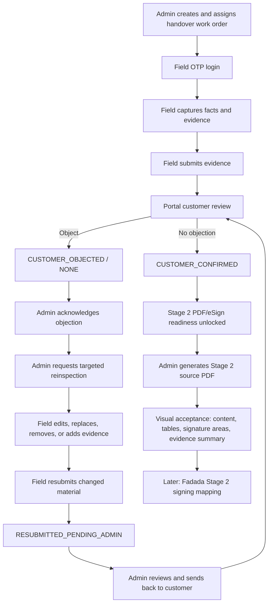

# Stage 2 Local Handover E2E Runbook

## Scope

This runbook validates the local Stage 2 handover path after field evidence capture, Portal customer review, and Admin Stage 2 source PDF generation are available. It is a local-first test harness only.

It may generate the local Stage 2 handover source PDF artifact for visual acceptance. It does not start eSign, upload to Fadada, create signing URLs, call SMS or WeChat providers, confirm delivery, start lease, or start billing.

## Closed-loop workflow



The Admin entry points are the order detail Stage 2 module and
`/handover-review-queue`. Field uses `/field/handover`,
`/field/handover/tasks`, and `/field/handover/tasks/:id`. The customer uses
`/portal/handover-reviews/:id`.

Every workflow mutation appends a typed handover event. Evidence replacement
and removal retain the original database row as `SUPERSEDED` or `REMOVED`;
only `ACTIVE` files appear in the current checklist. Normal evidence items
have one active file and support replace/remove. Damage close-ups support up
to 20 active files so multiple damage locations can be documented.

## Local Harness

API test:

- `apps/api/test/stage2-handover-e2e.spec.ts`

The API harness uses synthetic in-memory data and mocked Prisma/storage/evidence collaborators. It covers:

- external field operator starts the handover work order;
- field facts are captured;
- required evidence files are attached with safe synthetic `fileId` records;
- no-visible-damage declaration is recorded;
- field evidence is submitted to customer review;
- Portal customer lists and opens the submitted review;
- Portal customer sees safe evidence preview/download links;
- Portal customer confirms no objection;
- Portal customer submits an objection on a fresh fixture;
- Admin acknowledges the objection, requests field resubmission, and sends the resubmitted evidence back to Portal review;
- Admin generates the Stage 2 source PDF after customer confirmation;
- the generated PDF uses the separate `DELIVERY_HANDOVER` contract path and safe `FileObject` download route;
- unauthorized customer and field-session boundary checks;
- terminal and already-confirmed/objected state checks;
- no eSign/provider/delivery/lease/billing side effects.

Web test:

- `apps/web/test/stage2-handover-ui-flow.spec.ts`

The Web harness uses mocked `fetch` calls only. It covers:

- field submit API boundary and submitted/locked capture view;
- Portal list/detail/confirm API boundary;
- Portal evidence file viewing boundary;
- Portal objection API boundary;
- Admin Stage 2 handover review entry and objection action boundary;
- Admin Stage 2 source PDF generate/download entry;
- acknowledgement/object reason view-model behavior;
- source-level absence of eSign, delivery confirmation, payment, or billing controls before later phases;
- view-model serialization that excludes object storage, signing URL, token/cookie, identity, provider, and finance internals.

## Readiness Expectations

Before a new order can enter the local or staging handover work-order path:

- Stage 1 signing must be complete.
- Delivery readiness must pass the base order/vehicle checks.
- A non-deleted active vehicle insurance policy covering the delivery check date is enough to satisfy insurance readiness; vehicle master insurance dates are fallback/read-model data.
- A zero required deposit must be treated as satisfied automatically. Non-zero deposits still require confirmation.
- First monthly fee readiness depends on receivable bill write-off. A confirmed payment record without write-off should be shown as registered but pending write-off, not as settled.
- Admin order detail must expose the Stage 2 create-work-order action once delivery preparation is ready and no active work order exists.

Before field submit:

- field readiness is blocked by incomplete field facts/evidence;
- Stage 2 PDF/eSign readiness is false.

After field submit:

- the work order is customer-reviewable;
- Portal review is visible only to the owning customer;
- Stage 2 PDF/eSign readiness is still false because the customer has not confirmed no objection.

After customer confirmation:

- the work order moves to customer-confirmed;
- Stage 2 PDF/eSign readiness is true;
- no PDF is created automatically;
- no eSign task, provider call, delivery confirmation, lease, or billing side effect is created.

After Admin source PDF generation:

- a separate Stage 2 `Contract` is created with an `HDV...` document number and `status=GENERATED`;
- `VehicleDeliveryHandover` is linked to `handoverContractId`, `sourceDocumentFileId`, `sourceObjectKey`, and `status=SOURCE_GENERATED`;
- `SubscriptionOrder.contractId`, order status, Stage 1 contract rows, finance, lease, and billing state remain unchanged;
- no `ContractESignTask`, Fadada upload, signing URL, SMS, WeChat, delivery confirmation, lease, or billing side effect is created;
- the Admin UI exposes a protected download route for visual acceptance.

Visual acceptance must confirm:

- PDF content and metadata;
- vehicle/customer/field facts tables;
- fee/deposit and special-notice sections;
- customer signature and platform seal/signature areas;
- 14-row evidence summary with safe file metadata only;
- absence of raw object storage keys, buckets, signing URLs, provider payloads, full phone numbers, and full identity numbers.

After customer objection:

- the work order moves to customer-objected;
- Stage 2 PDF/eSign readiness remains false;
- the blocker requires Admin follow-up;
- no PDF, eSign task, provider call, delivery confirmation, lease, or billing side effect is created.

After Admin-requested field resubmission:

- the field operator can edit the objected task again;
- resubmission keeps the work order customer-objected and marks admin review `RESUBMITTED_PENDING_ADMIN`;
- Portal confirmation remains blocked until Admin sends the resubmitted evidence back to customer review;
- sending back creates the next review attempt and returns the work order to customer-reviewing.

## Local Commands

Focused API harness:

```bash
pnpm --filter @subscription-saas/api exec vitest run test/stage2-handover-e2e.spec.ts
```

Focused Stage 2 PDF harness:

```bash
pnpm --filter @subscription-saas/api exec vitest run test/stage2-handover-pdf.spec.ts
```

Focused Web harness:

```bash
pnpm --filter @subscription-saas/web exec vitest run test/stage2-handover-ui-flow.spec.ts
```

Full verification for this phase:

```bash
pnpm --filter @subscription-saas/api prisma:validate
pnpm --filter @subscription-saas/api typecheck
pnpm --filter @subscription-saas/api lint
pnpm --filter @subscription-saas/api exec vitest run test/stage2-handover-pdf.spec.ts
pnpm --filter @subscription-saas/api exec vitest run test/stage2-handover-e2e.spec.ts test/portal-handover-review.spec.ts test/field-operator-auth.spec.ts test/handover-work-order.spec.ts test/delivery-evidence.spec.ts
pnpm --filter @subscription-saas/api exec vitest run test/portal-auth.spec.ts test/order-delivery.spec.ts test/esign.spec.ts test/order-contract.spec.ts
pnpm --filter @subscription-saas/api build
pnpm --filter @subscription-saas/web test
pnpm --filter @subscription-saas/web typecheck
pnpm --filter @subscription-saas/web lint
pnpm --filter @subscription-saas/web build
```

## Staging Smoke Boundary

Staging smoke should run only after a combined API/Web deployment. The deployed Web API base must point to the public H5/API domain used by that environment; staging validation must not rely on a local loopback API or port 3001.

The staging smoke should cover one controlled field evidence capture path, one Portal customer review path, and, when deployment scope includes this renderer, one Admin Stage 2 source PDF generation/download path. It should still avoid Fadada, Stage 2 eSign, real SMS, WeChat, delivery confirmation, lease, and billing until those later phases are explicitly enabled.

Field evidence accepts photos up to 10MB and videos up to 300MB. The API Nginx virtual host must set `client_max_body_size 320m` or higher, `proxy_read_timeout`/`proxy_send_timeout` to `1200s`, and `proxy_request_buffering off`. Uploads are spooled to an OS temporary file before local/OSS persistence and the temporary file is cleaned up on success or failure. Validate proxy size, API multipart size, available temporary disk space, and storage connectivity when a large upload fails.

Browser smoke must cover:

- mobile WebKit as the local approximation for iPhone Safari;
- an iPhone WeChat user agent in Chromium/Edge;
- desktop Edge;
- Chrome in the normal Admin/Field manual pass;
- login inputs remaining editable while session detection is pending;
- a failed task-list request showing `重新加载` and recovering after retry.

Bodyless GET requests do not send a JSON `Content-Type`, which avoids an
unnecessary CORS preflight in stricter WebViews. API requests time out after
15 seconds and the Field task list/detail pages expose retry actions instead
of leaving the operator on an indefinite spinner.

## Open Items

- Stage 2 PDF visual acceptance in the target environment before provider work;
- Stage 2 Fadada provider mapping and eSign after PDF visual acceptance;
- Admin void/escalation handling beyond resubmission/send-back;
- audit timezone cleanup;
- PR #224 upload-limit/proxy rollout is tracked separately from this PDF renderer;
- real-device H5/WeChat/Safari smoke remains deferred until the deployment smoke window.
