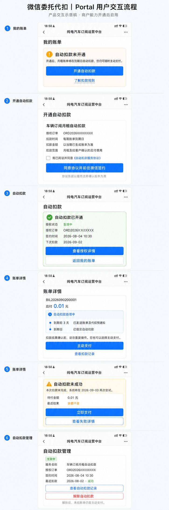

# Stage 1B-B 微信授权代扣基础能力设计

**日期：** 2026-08-04

**状态：** 已批准

**实施波次：** Stage 1B-B

**关联基线：**

- `2026-07-29-six-month-subscription-automation-design.zh-CN.md`
- `2026-07-30-three-stage-subscription-capability-roadmap-design.zh-CN.md`
- `2026-07-31-stage1b-recurring-billing-overdue-automation-design.zh-CN.md`

## 1. 背景与结论

Stage 1B-A 已经提供周期月租账单计划、持久化自动化任务、客户主动支付、支付回调、应收核销、到期通知和 D+5 自动逾期处理。本批在该底座上增加授权代扣领域事实和扣款编排，不建设第二套账单、支付或核销体系。

当前商户号尚未开通微信委托扣款，也没有审核通过的自动续费模板 ID。因此本批交付分为两层：

1. 现在完成支付授权、扣款尝试、任务编排、并发核销保护、Portal/Admin 交互和 Staging Mock 验收；
2. 商户开通委托扣款并取得模板 ID 后，补充真实微信签约/解约/扣款适配器和小额实扣验收。

本批不得把 Mock 结果描述成真实微信代扣完成，也不得在生产环境以 Mock 代替渠道。

## 2. 方案选择

采用在现有 `BillingSchedule`、`SubscriptionAutomationJob`、`PaymentOrder`、`PaymentRecord` 和 `PaymentWriteOff` 上增量扩展的方案。

不采用以下方案：

- 不先建设通用工作流内核。代扣有明确的账单计划和任务队列边界，先建设通用流程会扩大本批范围；
- 不把代扣直接塞入现有 JSAPI `createPayment()`。授权协议、异步受理、状态查询和多轮重试需要独立领域事实；
- 不为代扣建立独立收款和核销事实。所有真实收款仍必须进入既有财务权威链路。

## 3. 范围

### 3.1 本批包含

- `PaymentMandate` 授权协议模型和状态机；
- `DebitAttempt` 扣款尝试模型和状态机；
- 到期日、D+1、D+3 三轮自动扣款任务；
- 扣款异步结果查询和状态不明恢复；
- 主动支付与代扣并发时的核销上限保护；
- 迟到代扣形成未分配收款异常；
- 连续扣款失败通知；
- Portal 授权、账单代扣状态、主动支付兜底和解约交互；
- Admin 授权、扣款、死信、状态不明和人工恢复工作台；
- 非生产环境 Mock 授权和扣款适配器；
- 生产开关、审计、迁移、自动化测试和人工验收清单。

### 3.2 本批不包含

- 真实微信委托扣款上线和真实资金验收；
- 自动退款；
- 银行卡、支付宝或其他渠道代扣；
- 通用流程实例/步骤内核；
- 车型包、合同变更、积分和权益加购；
- 因扣款失败自动暂停订单、车辆或 Lease。

## 4. 服务边界

新增 `auto-debit` 领域模块，内部职责如下：

- 授权服务：创建签约会话、接收授权结果、查询、暂停、恢复和解约；
- 扣款服务：创建扣款尝试、提交、查询和解释渠道结果；
- 任务处理器：处理三轮扣款、状态查询和失败通知；
- 结算协调器：把成功渠道交易交给现有财务服务入账和核销；
- Mock 适配器：仅在非生产环境提供确定性签约和异步扣款结果；
- Admin 服务：查询、状态同步、人工重试、人工扣款和异常恢复；
- Portal 服务：展示授权和扣款状态，发起签约/解约，并保持主动支付可用。

现有 `billing-automation` Worker 继续负责租约抢占、退避、死信和恢复。Worker 只分派任务，不直接创建收款或修改核销事实。

## 5. 数据模型

### 5.1 `PaymentMandate`

`PaymentMandate` 表示客户针对一个订阅订单作出的代扣授权。历史授权不得覆盖或删除。

主要字段：

- `id`、`mandateNo`；
- `customerId`、`orderId`；
- `provider`；
- `providerMandateId`；
- `providerTemplateId`；
- `providerMode`；
- `status`；
- `signedAt`、`effectiveAt`、`suspendedAt`、`revokedAt`、`expiresAt`；
- `lastSyncedAt`；
- `requestSnapshot`、`responseSnapshot`、`callbackSnapshot`、`errorSnapshot`；
- `createdAt`、`updatedAt`、`createdBy`、`updatedBy`。

状态枚举：

- `PENDING`：签约已发起，尚未确认生效；
- `ACTIVE`：可用于发起扣款；
- `SUSPENDED`：暂不可扣款，但可通过渠道同步恢复；
- `REVOKED`：客户或商户已解约；
- `EXPIRED`：授权超过有效期；
- `FAILED`：签约确定性失败。

允许的主要迁移：

- `PENDING -> ACTIVE | FAILED | REVOKED | EXPIRED`；
- `ACTIVE -> SUSPENDED | REVOKED | EXPIRED`；
- `SUSPENDED -> ACTIVE | REVOKED | EXPIRED`。

终态授权不能重新激活。重新签约必须创建新的 `PaymentMandate`。

约束：

- `mandateNo` 唯一；
- `(provider, providerMandateId)` 在渠道协议 ID 存在时唯一；
- 一个订单最多存在一个处于 `PENDING/ACTIVE/SUSPENDED` 的开放授权；
- 开放授权唯一性使用数据库部分唯一索引保证，而不只依赖应用层检查。

### 5.2 `DebitAttempt`

`DebitAttempt` 表示针对一张账单的一次渠道扣款请求。一次尝试只关联一个账单和一个授权。

主要字段：

- `id`、`debitAttemptNo`；
- `mandateId`、`billId`、`orderId`、`customerId`；
- `paymentOrderId`；
- `retrySlot`：`DUE`、`D1`、`D3` 或 `MANUAL`；
- `status`；
- `requestedAmount`、`confirmedAmount`，单位均为分并使用 `BigInt`；
- `idempotencyKey`；
- `providerOutTradeNo`、`providerTransactionId`；
- `submittedAt`、`acceptedAt`、`resolvedAt`、`cancelledAt`；
- `requestSnapshot`、`responseSnapshot`、`callbackSnapshot`、`errorSnapshot`；
- `lastErrorCode`、`lastErrorMessage`；
- `createdAt`、`updatedAt`、`createdBy`、`updatedBy`。

状态枚举：

- `CREATED`：领域事实已创建，尚未调用渠道；
- `SUBMITTING`：渠道请求可能已经发出；
- `PROCESSING`：渠道已受理，结果尚未确定；
- `UNKNOWN`：网络中断或进程故障导致结果不明；
- `SUCCEEDED`：渠道确认扣款成功；
- `FAILED_RETRYABLE`：本次尝试终止，但账单允许后续轮次；
- `FAILED_FINAL`：不可重试或已到最后自动轮次；
- `CANCELLED`：账单已结清、授权失效或人工取消且渠道尚未受理。

约束：

- `debitAttemptNo`、`idempotencyKey`、`providerOutTradeNo` 唯一；
- `paymentOrderId` 一对一唯一；
- 自动轮次幂等键为 `debit:{billId}:{retrySlot}`；
- 手工扣款使用独立操作 ID 生成稳定幂等键；
- 请求金额必须大于零；
- 已成功的渠道交易不能回退到失败或取消状态。

### 5.3 与现有支付模型的关系

每个 `DebitAttempt` 创建一个底层 `PaymentOrder`，支付渠道扩展为 `WECHAT_AUTO_DEBIT` 或 Mock 对应渠道。`PaymentOrder` 继续负责渠道交易引用、回调日志和 `PaymentRecord` 关联。

代扣不直接写 `PaymentWriteOff`。只有统一结算协调器可以调用现有财务领域服务完成收款和核销。

## 6. 渠道适配器

定义独立的 `MandateDebitProvider` 接口，至少包含：

- `createMandateSession`；
- `queryMandate`；
- `revokeMandate`；
- `submitDebit`；
- `queryDebit`；
- `verifyMandateCallback`；
- `verifyDebitCallback`。

接口结果必须区分：

- 请求被受理；
- 渠道最终成功；
- 可重试失败；
- 不可重试失败；
- 状态不明。

渠道“受理成功”不能直接触发核销。

### 6.1 微信真实适配器边界

微信委托扣款需要商户单独申请权限和模板。当前外部能力尚未开通，本批只固化接口、配置、回调安全和契约测试边界，不把真实适配器标记为已上线。

未来真实接入至少需要：

- 已审核模板 ID；
- 确认的自动续费/扣费模式；
- 签约和解约页面；
- 授权结果回调地址；
- 扣款结果回调地址；
- 渠道订单主动查询；
- 小额真实签约、扣款、失败和解约验收。

参考：<https://pay.wechatpay.cn/doc/v2/merchant/4011986709>

### 6.2 Staging Mock

Mock 仅在同时满足以下条件时启用：

- 运行环境不是 production；
- `PAYMENT_MANDATE_PROVIDER=mock`；
- 显式 Mock 开关为 true。

Production 检测到 Mock 配置时必须启动失败或强制禁用，不能静默降级。

Mock 支持：

- 签约成功和解约；
- 异步扣款成功；
- 可重试失败；
- 最终失败；
- 超时/状态不明；
- 状态查询后恢复。

模拟结果只能通过具备权限的 Admin 测试入口控制，Portal 客户不能指定结果。所有模拟页面永久显示“STAGING MOCK，不会发生真实扣款”。

## 7. 自动化时间线

所有日期按 `Asia/Shanghai` 业务日计算。默认自动扣款执行时间为 09:00，可配置但必须保留明确时区。

| 时间 | 系统动作 |
| --- | --- |
| D-3 | 生成或确认月租账单，发送账单及代扣预通知，插入后续扣款任务 |
| 到期日 D | 发起第一次自动扣款 |
| D+1 | 对未结清且允许重试的账单发起第二次扣款 |
| D+3 | 发起最后一次自动扣款，失败后发送高优先级通知 |
| D+5 | 仍未结清则标记逾期并创建或更新催收案件 |

新增任务类型：

- `SUBMIT_BILL_DEBIT`，通过载荷区分 `DUE/D1/D3`；
- `QUERY_DEBIT_ATTEMPT`；
- `SEND_DEBIT_FAILURE_NOTICE`；
- `SYNC_PAYMENT_MANDATE`。

其中 `SYNC_PAYMENT_MANDATE` 是真实渠道接入后的耐久化同步预留类型；当前商户能力尚未开通，本批 Staging Mock 不创建该任务，授权状态同步通过带权限和原因审计的 Admin 操作执行。真实微信适配器接入时必须同时实现该任务的 Worker handler，不能只开启枚举或配置。

D-3 创建账单的事务同时插入三次扣款任务和 D+5 逾期任务。重复生成、重复调度和 Worker 重启不能产生重复事实。

现有人工“逾期刷新”可以在到期次日处理，不修改；自动化任务继续按 D+5 执行。

## 8. 扣款执行规则

任务执行前必须重新读取账单、订单、授权和前序尝试：

1. 账单已结清、取消或剩余金额为零：任务无副作用完成；
2. 没有有效授权：本轮记录为跳过，主动支付继续可用，后续轮次重新检查；
3. 存在 `PROCESSING/UNKNOWN/SUBMITTING` 尝试：只查询原尝试，不创建新扣款；
4. 上一轮已经明确失败且允许重试：创建下一轮尝试；
5. 授权暂停、解约或失效：不得发起扣款；
6. 订单、账单和授权关系不一致：进入可见死信，不自动修正业务事实。

外部调用前必须持久化 `SUBMITTING` 状态和唯一商户扣款单号。进程在调用期间中断时，恢复逻辑先按该单号查询渠道；只有渠道明确不存在该订单时，才允许使用相同幂等键安全重放。

D+5 时，即使仍有状态不明的渠道交易，也按真实剩余应收进入逾期。迟到成功回调再通过统一结清协调器更新账单和催收案件。

## 9. 主动支付与代扣并发

主动支付和代扣成功均进入同一个结算协调器：

1. 按渠道交易唯一键保证每笔资金只入账一次；
2. 在数据库事务内锁定账单；
3. 重新读取 `remainingAmount`；
4. 核销金额为 `min(渠道实收金额, remainingAmount)`；
5. 创建一次 `PaymentRecord` 和不超过剩余应收的 `PaymentWriteOff`；
6. 结清后取消尚未执行的代扣、到期和逾期任务；
7. 更新或关闭有效催收案件。

如果主动支付已经结清，而在途代扣随后成功：

- 必须完整记录真实渠道收款；
- 不向已结清账单超额核销；
- 未分配金额形成“客户未分配收款”异常；
- 由运营人工决定退款或后续抵扣；
- 本批不自动退款。

## 10. 通知策略

- D-3：Portal 站内消息和微信服务号账单/代扣预通知；
- 扣款成功：Portal 持久记录，可选微信服务号消息；
- D、D+1 失败：Portal 显示失败和下一次重试时间；
- D+3 最终失败：Portal 和微信服务号高优先级通知，并尝试短信；
- D+5 逾期：沿用现有逾期通知和催收流程。

短信模板尚未配置时，记录 `CHANNEL_NOT_CONFIGURED` 并在后台显示。通知失败不能回滚扣款、账单或核销事务。

## 11. Portal 交互

首次主动支付成功后，Portal 显示“开通自动扣款”引导。未配置真实微信渠道时，Production 只显示“自动扣款暂未开通”，不能出现模拟入口。

Portal 至少提供：

- 授权状态和范围；
- 签约时间、所属订单和下一次计划扣款日；
- 最近扣款结果和重试时间；
- 主动支付兜底；
- 授权详情和解约入口；
- 扣款记录列表；
- Mock 环境的显著标识。

## 12. Admin 交互

订单“财务/收款核销”页展示：

- 当前授权状态；
- 到期日、D+1、D+3 三轮任务；
- 扣款尝试和渠道结果；
- PaymentOrder、PaymentRecord 和 PaymentWriteOff 关系；
- 未分配收款和异常状态。

月租自动化页面增加：

- 授权状态筛选；
- 扣款状态筛选；
- 状态不明、死信和未分配收款筛选；
- 授权同步；
- 查询渠道结果；
- 重试任务；
- 人工扣款；
- 取消未执行任务。

状态不明的尝试只能“查询结果”，不能直接再次扣款。

人工扣款必须具备财务权限、填写操作原因并进行二次确认。执行前再次检查账单未结清、授权有效且不存在未决扣款。

## 13. 权限、审计与安全

- Portal 客户只能操作本人、本人订单和本人授权；
- 授权同步、人工重试和人工扣款使用独立后台权限；
- 所有自动动作记录 `actorType = SYSTEM`、任务 ID 和幂等键；
- 所有人工动作记录人员、原因、请求上下文和前后快照；
- 回调必须验证签名、商户号、AppID、金额和订单关系；
- 回调日志只保存必要业务快照，不保存支付密钥或完整敏感凭证；
- 错误快照不得包含私钥、API v3 Key 或用户完整支付标识。

## 14. 发布与迁移

1. 新增枚举、`PaymentMandate`、`DebitAttempt`、关系、约束和索引；
2. 数据库迁移只做加法，不修改历史迁移和历史支付事实；
3. 部署后保持 `AUTO_DEBIT_ENABLED=false`；
4. 验证主动支付、周期出账和 D+5 催收无回归；
5. Staging 开启 Mock 并完成人工验收；
6. Production 保持关闭，直到商户权限和模板审核完成；
7. 补充真实适配器并完成小额实扣后，再允许生产启用。

历史数据不补造授权，也不修改现有账单、支付和核销事实。新授权生效后，只为尚未经过最后自动扣款窗口的未结账单补建未来任务。

固定发布顺序仍为：执行数据库迁移、等待容器 healthy、执行公网健康检查。

## 15. 测试与验收

### 15.1 单元测试

- 授权状态迁移；
- 扣款状态迁移；
- D-3、D、D+1、D+3、D+5 日历计算；
- 幂等键和商户扣款单号；
- 渠道结果分类；
- Production Mock 拒绝；
- 金额上限和未分配金额计算。

### 15.2 集成测试

- 账单创建事务插入三轮代扣任务；
- 无授权时安全跳过；
- 授权在后续轮次前生效后可以扣款；
- 状态不明时只查询、不重复提交；
- Worker 租约过期恢复；
- 重复回调只入账一次；
- 主动支付完成后取消待执行代扣；
- 并发支付不超额核销；
- 迟到代扣形成未分配收款异常；
- 最终失败通知和 D+5 催收幂等；
- 解约后不再扣款。

### 15.3 Staging 人工验收

至少覆盖：

1. 到期日一次成功；
2. 到期日失败、D+1 成功；
3. 三次失败后通知，D+5 进入催收；
4. 到期前主动支付取消代扣；
5. 状态不明查询恢复；
6. 主动支付与在途代扣并发；
7. 迟到成功产生未分配收款；
8. 授权解约；
9. Worker 重启和死信人工恢复；
10. Production 配置检查严格关闭 Mock。

真实微信签约和实扣不属于本轮可完成的验收项，必须在商户能力开通后单独补验。

## 16. Portal 产品交互长图

微信商户申请委托扣款需要提供单独开发的产品交互页面。本批提供用户端 Portal 页面拼接长图，覆盖：

1. 我的账单中的开通入口；
2. 授权范围和协议确认；
3. 签约成功状态；
4. 账单自动扣款处理中；
5. 扣款失败后的主动支付兜底；
6. 授权详情和解约入口。

该图是产品交互示意稿。最终协议条款、授权范围文案和真实微信签约页面必须在商户申请及法务确认后对齐。

## 17. 后续波次

Stage 1B-B 完成并通过 Mock 验收后，阶段 1 后续独立设计顺序为：

1. 合同变更与履约期内换车/提前结束/协议延长；
2. 车型包多车型版本和权益/积分增强；
3. Stage 1C 资产运营工单、运营限制和不可变车辆成本台账。

真实微信委托扣款适配器在商户能力开通后插入 Stage 1B-B 的渠道补充波次，不改变上述领域模型、任务和核销边界。
